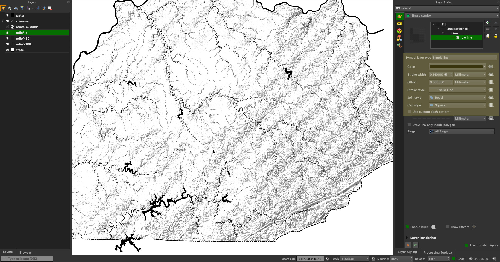

# Monochromatic Maps in QGIS
Custom hillshades with one color

 *Tie-dye required when mapping in one hue!*

<!-- TOC -->

- [Monochromatic Maps in QGIS](#monochromatic-maps-in-qgis)
    - [TL;DR](#tldr)
    - [Preamble](#preamble)
    - [Caveats](#caveats)
    - [Overview](#overview)
    - [Technique](#technique)
        - [Basic flow](#basic-flow)
        - [QGIS tool chain](#qgis-tool-chain)
        - [Comparing different scales](#comparing-different-scales)
        - [Scripting the workflow](#scripting-the-workflow)
    - [Conclusions](#conclusions)
    - [Would you like to present a 30-minute workshop?](#would-you-like-to-present-a-30-minute-workshop)

<!-- /TOC -->

## TL;DR

   
*Example crosshatch technique for shading*

## Preamble

We are glad to reboot this fine tradition of exploring and sharing open source mapping techniques. One of the esteemed organizers who has since migrated outside of Kentucky had one plea for us; make sure our maps maximize [spatial oomph](spatialoomph.mp3). To the goal we selected a challenge to map under severe constraints by using only one color and exactly one color. No color ramps or gradients are allowed, because it is a trivial affair to convert a grayscale map to any hue as demonstrated in Photoshop.

    
*Converting grayscale mode to duotone mode in Photoshop*

One tactic to create one-color maps entail learning drawing  and engraving techniques on the order of Erwin Raisz, Albrecht Dürer, et al.; a journey for another day. Recently, Daniel Huffman at [somethingaboutmaps.wordpress.com](https://somethingaboutmaps.wordpress.com/) has created a [Monocarto competion](https://somethingaboutmaps.wordpress.com/monocarto-2019-winners/) that attracted many awesome entries. Kudos! Daniel himself has pursued single color (or two-color) maps in his [Typewriter Maps](https://somethingaboutmaps.com/Typewriter-Maps).

Consider this brief tutorial a programmatic way to create hillshade effects in one color. You likely will ask, why even do this when we have lasers and VR?

* Single-color images are reproducible on the greatest variety of media (think swag!)
* They are lighter weight in file size compared to their multi-hue siblings
* Images can take on a historic/hand-drawn patina, which ups the spatial oomph index
* What's old is always new again (remember business in the front, party in the back, baby)

## Caveats

We're making maps in one color. The dynamic range is basically one step; on or off, 1-bit color depth. The other limiting factor is using only QGIS for design. Kicking our processed layers to Illustrator would certainly expand our toolkit. That said, QGIS does an excellent job getting us data to play with (no small task!) and future goals might push this data to more capable design software. So, let's begin!

## Overview 

First, extract the [QGIS-project-and-data.zip](QGIS-project-and-data.zip) file which contains everything you need to start. The files includes the QGIS project file (3.8.2) , a digital elevation model (DEM) for Kentucky resampled to 1,000 ft per pixel, and vector layers for streams, waterbodies, and Kentucky's boundary in a GeoPackage format. The [National Map](https://viewer.nationalmap.gov/basic/) provided the digital elevation model and the [Small-scale edition of the National Map](https://nationalmap.gov/small_scale/atlasftp.html) provided the vector layers. 

We decided to work at a smaller scale for demonstration. Larger scale projects do look better, but the processing time increase dramatically. Comparisons are shown at the end. If you would like to work with the high resolution data for Kentucky, just let me know and I can point you to the 2 GB tif + GPKG zip file.

## Technique

A hillshade function depicts elevation relief by illuminating a surface with a fixed light source. The output of the function is typically a grayscale image and is widely used to represent 3D features on a map.

   
*Hillshade of the Bluegrass*


This image is intuitive. In areas of high relief, e.g., knobs or mountains, the image has many light and dark cells. We equate the darker cells as shaded. Our goal is to replace the shaded areas with a crosshatch shading, a common technique in drawing.

   
*Crosshatch shading brushes in Autodesk Sketch Book Pro*

In order to substitute gray areas on the hillshade with crosshatches, we need to classify the hillshade into discrete areas. The *hook* with this method is selecting the right sets of areas where you can build up crosshatching to mimic grayscale shading. Let's now turn a strategy for doing this. 

### Basic flow 

OK! Now the fun begins. With QGIS up and running, here are the steps in our processing workflow.

1. Consider resampling the DEM raster to very low resolution to start. You can always use the full-strength version later.
2. Create a hillshade that exaggerates the relief. We need lots of shaded areas for a convincing effect.
3. Select two or three shaded values in the resulting hillshade that represent the areas you want build up crosshatching.
4. Export these values 1-bit rasters.
5. Convert these raster to polygon layers with an attribute that indicates whether it is shaded or not shaded.
6. Delete polygons without shading, which helps application performance. Buffer/dissolve shade polygons can also boost application performance (not necessary but can help smooth polygons in Q).
7. Apply line pattern fills to the finished polygons in QGIS Layer Styling panel.

### QGIS tool chain

If you are using layers outside of Kentucky or need to reset your layer styles, **Load Style** from the *.qml* files found in the *styles* folder. 

   
*Load vector styles from .qml files*

Find the **Raster > Analysis > Warp (reproject)** in the QGIS menu. Change the output resolution if necessary.

   
*Change the output resolution if necessary*

Find the **Raster > Analysis > Hillshade** in the QGIS menu. Use an exaggerated Z factor.

   
*Hillshade function with exaggerated Z factor*

Find the **Identify Tool** in the QGIS **Attribute** toolbar and select shade values to convert to polygons.

   
*Select shade values to convert to polygons*

Find the **Raster > Raster Calculator** in the QGIS menu. Add an expression that selects all values beneath the shaded value, e.g.,

```sql
"Hillsahde-1000ft-10z@1" <= 50
```

   
*Raster Calcuator creates 1-bit raster*

Find the **Raster > Conversion > Polygonize** in the QGIS menu and convert to polygon in the GeoPackage format. Go get a coffee if you're working with high resolution stuff.

   
*Convert raster to polygon in the GeoPackage format*

Open the polygon layer's attribute table and use the **Select by Expression** pane to select and delete all `0` values, which indicate areas that are not shaded. Save your result

   
*Delete polygons without shading*.

Find the **Vector > Geoprocessing tools > Buffer** in the QGIS menu and apply buffer and dissolve to boost performance. Optional.

   
*Dissolve buffered polygons*.

Double-click the polygon layer to access its Symbology settings. Select **Single Symbol** dropdown then apply a **Line Pattern fill**. Make the **Simple line** use a thin stroke.

   
*Line Pattern fill in Symbology*

Finally, while still in the Symbology pane, select the **Line Pattern fill** and change alternate the **Rotation** and **Spacing** settings to build up crosshatching affect.

   
*Rotate the line angle to develop crosshatching*.

### Comparing different scales

In QGIS, this effect varies somewhat dramatically at different scales. At 1:800k, the crosshatching becomes fragmented on export.

.png)   
*Enlarge this image to inspect fragmented crosshatching*

While at large scales, the crosshatching needs more spacing.

.png)   
*Large-scale crosshatching needs more TLC*

### Scripting the workflow

Turns out this is a highly iterative technique. So, let's script it to kick out layers ready for symbology.

```bash
#########################################
# Set up variables and remove prior runs
#
# Input DEM
input='../DEM_40m.tif'

# Resample DEM
resolution='1000'

# Z factor to increase relief in hillshade
z='14'

# Digital number from hillshade
DN='5 30 100'

# Ouput directory for polygonized hillshade
output=relief$resolution$z

# Goodbye!
rm e*.tif
#
#########################################

echo "Let's go!"

#########################################

gdalwarp -tr $resolution $resolution -r near -of GTiff $input eDEM.tif

gdaldem hillshade eDEM.tif eHillshade-$z.tif -of GTiff -b 1 -z $z -s 1.0 -az 315.0 -alt 45.0

mkdir $output

for value in $DN; do
    gdal_calc.py -A eHillshade-$z.tif --outfile=eRelief-$value.tif --calc="A <= $value"
    gdal_polygonize.py eRelief-$value.tif relief-$value.gpkg -b 1 -f "GPKG" relief-$value DN
    ogr2ogr -f GPKG $output/relief-$value.gpkg -where "DN = 1" relief-$value.gpkg
    rm relief-$value.gpkg
done
```

Two scripts, one for macOS and Windows OS, are found in the *export* folder in the supplied project file. Run in your GDAL or OSGeo4W powered shell.

## Conclusions

QGIS provides the excellent toolkit to produce our data, but is a little too unpredictable in symbolizing features at different scales. However, QGIS can produce PNG raster tilesets with the `gdal2tiles` tool as demonstrated in the [map of the Bluegrass](map).

## Would you like to present a 30-minute workshop?

Please check out our [Fall schedule](https://github.com/maptimelex/schedule). We have two 30-minute slots. The schedule can change! [Map](https://maptimelex.github.io/location/) of our new location on UK's campus


